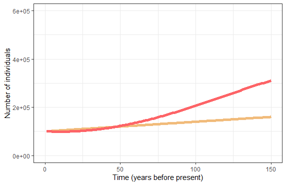
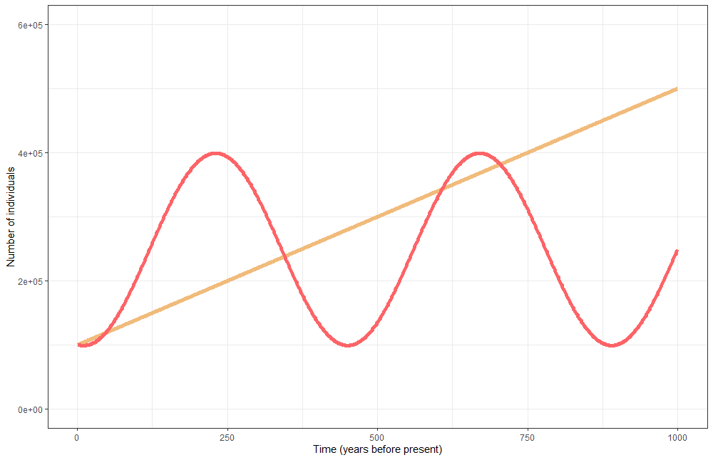
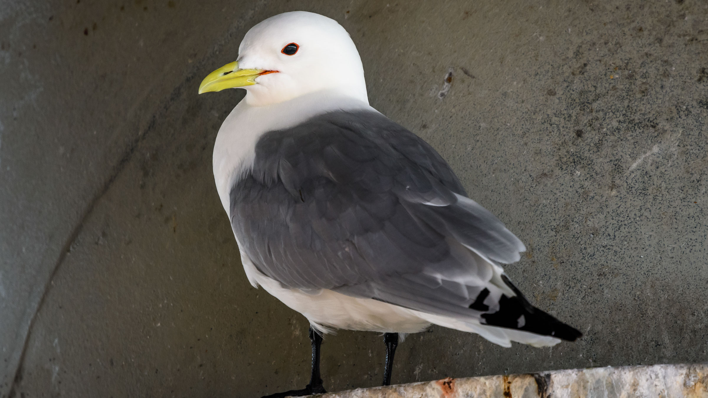
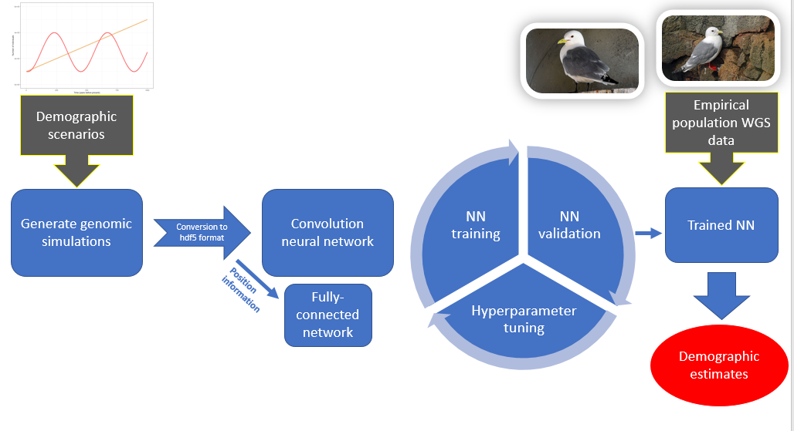

## NEvolve Readme
---
 

### About NEvolve
The advent of inexpensive next-generation genome sequencing (a set of DNA sequencing methodologies that capture the majority of information present in an individual's genetic code) has enabled rapid advances in our ability to estimate species' historical and contemporary population trends.

This is timely, as human activities threaten biodiversity on a global scale, which necessitates unprecedented levels of monitoring and intervention to mitigate a catastrophic number of extinctions.

To effectively manage the health of at-risk species and allocate funding, it is important for us to have a robust understanding of species' current and historical population trends (for example, recent declines in a species with a history of large population swings would likely be less concerncing than a continuous decline in a species that historically had a large population). See example plots below
<table>
   <tr>
      <td>

      </td>
      <td>

      </td>
   </tr>
</table>
### Primary functionality

NEvolve is a neural net project that aims to classify and elucidate species' demographic histories using solely genomic data. Our code generates simulated genomic data derived from potential demographic scenarios, uses supervised learning to train a convolutional neural network, and then attempts to classify real-world seabird genomic data.

We are particularly interested in assessing the history and current prospects of seabirds (see two example images below, black-legged kittiwake and Leach's storm-petrel). However, we hope to make our method generalizable to any species.
<table>
   <tr>
      <td>

      </td>
      <td>

      </td>
   </tr>
</table>

### Conceptual flow chart

### Current progress

Our pipeline consists of:
* Simulation generation
    * Using <i>ms</i>, a program written in C
    * Outputs simulation results to a text file 
* Conversion
  * Converts the text output of <i>ms</i> to hdf5
* A preliminary convolutional neural network
  * Uses <i>Pytorch</i>

### Goals and future directions
Though all steps in our pipeline function, we have not managed to streamline the conversion and training of our neural network. To effectively train our network, we will need to process at least a million simulations (likely more will be necessary for more complicated demographic inference). We hope to be able to achieve a fast and efficient training pipeline by the end of the backathon . We would specifically like to:
* Efficiently convert our simulations to conveniently- batched hdf5 files
* Optimize data loading onto the GPU
* Network training speed and accuracy (i.e., hyperparameter tuning)

#### Future
NEvolve is currently designed to assess 'RadSeq' datasets, which are derived from reduced representation sequencing of genomic data (capturing perhaps a couple percent of the amount of information in the genome). We would like to scale up to analyzing whole-genome sequence data. We also plan to shift to using a continuous output layer as opposed to categories.

